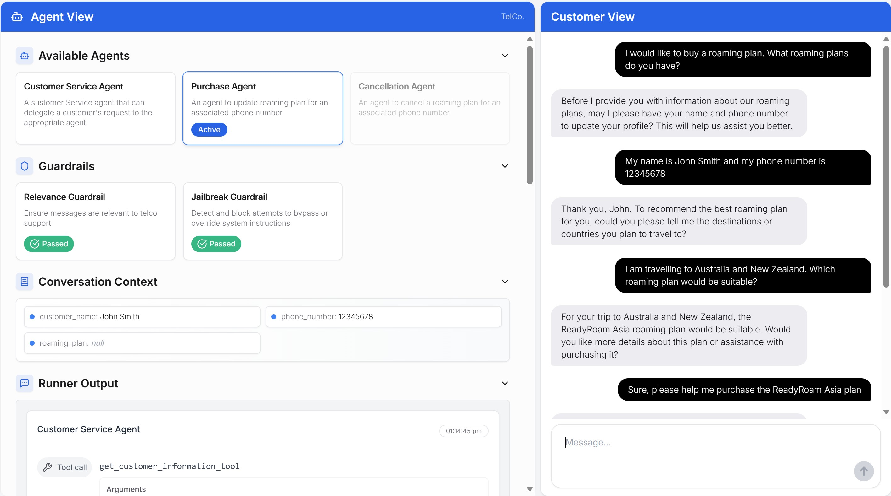

# Customer Service Agents Demo

[](LICENSE)


This repository contains a demo of a Customer Service Agent interface built on top of the [OpenAI Agents SDK](https://openai.github.io/openai-agents-python/).
It is composed of two parts:

1. A python backend that handles the agent orchestration logic, implementing the Agents SDK [customer service example](https://github.com/openai/openai-agents-python/tree/main/examples/customer_service)

2. A Next.js UI allowing the visualization of the agent orchestration process and providing a chat interface.



## How to use

### Setting your OpenAI API key

You must set your valid OpenAI API key in your environment variables by running the following command in your terminal:
```bash
export OPENAI_API_KEY=your_api_key
```

or if using powershell
```powershell
$env:OPENAI_API_KEY=your_api_key
```

Alternatively, you can modify the `compose.yaml` file and manually set the `OPENAI_API_KEY` environment variable. Take care not to expose your API key if so.

### Install dependencies

Options:
1. self-hosting,  this demo requires Docker to be installed.
2. on Replit; [import this github repo](https://replit.com/import/github) into your account.

### Run the app

Self Hosted (Docker) option
1. [clone](https://docs.github.com/en/repositories/creating-and-managing-repositories/cloning-a-repository) the repo to your own local directory (or [download](https://docs.github.com/en/get-started/start-your-journey/downloading-files-from-github#downloading-a-repositorys-files) & unzip).
2. in your local directory, run the docker compose file `docker compose up --build`
3. when app is ready, go to `http://localhost:3000`

---

Replit option
1. Start the workflow by click the green Run button.
2. Set your OPENAI_API_KEY in the environment (see instructions above).
3. In the console, do `./run.sh`. 
4. A browser window will pop up. Change the Dev URL to listen to port 3000, and wait for the app to be ready.

## Demo Flows

### Demo flow #1 - Purchasing New Roaming Plan

1. **Start with a roaming plan purchase:**
   - User: "I would like to buy a roaming plan. What roaming plans do you have?"
   - The Customer Service (CS) Agent should recognize your intent and prompt you to provide your name & mobile number.
   - CS Agent: "To assist you with information about roaming plans and help you find the best one, I'll need to know your name and phone number first. Could you please provide those details?"

2. **After providing your information:**
   - User: "My name is John Smith and my phone number is 91111111."
   - CS Agent will be update with your information, and hand you off to Roaming Agent.
   - Roaming Agent: "Thank you, John. Could you please tell me the destination or destinations you plan to travel to? This will help me recommend the best roaming plan for your trip."

3. **Query travel destinations:**
   - User: "I am travelling to Australia and New Zealand. Which roaming plan would be suitable?"
   - Roaming agent will use a lookup tool to match the most appropriate roaming plan (Neighbours, Asia, Worldwide, or Others).
   - Roaming Agent: "For your trip to Australia and New Zealand, the ReadyRoam Asia roaming plan would be suitable. If you need more details about this plan or want to proceed with the purchase, please let me know!"
   - Verification: [ReadyRoam Asia plan coverage](https://www.singtel.com/personal/products-services/mobile/roaming/all-plans/18-destinations)

4. **Purchasing:**
   - User: "Sure, please help me purchase the ReadyRoam Asia plan"
   - Will be handed off to Purchase Agent, which requires additional confirmation.
   - Purchase Agent: "Before I proceed with purchasing the plan, I would like to confirm that your phone number is 91111111 and your current plan is None. Could you please confirm if this is correct?"
     
5. **Approval**
   - User: "Yes that is correct"
   - Purchase Agent will purchase the plan (using tool) and hand off to CS agent
   - CS Agent: "The ReadyRoam Asia plan has been successfully purchased for your phone number. If you have any other questions or need further assistance, feel free to ask!"

6. **Curiosity/FAQ:**
   - User: "How can I check the amount of roaming data I have used?" 
   - CS Agent will handoff back to Roaming Agent, to use a RAG tool to answer FAQs.
   - Roaming Agent: "You can check the amount of roaming data you have used by using the My Singtel app. On the homescreen of the app, simply toggle to "Roam" under your mobile number to view your roaming data usage and charges. If you need further help, feel free to ask!"
   - Verification: [from FAQ: "How can I check my data usage consumption?"](https://www.singtel.com/personal/products-services/mobile/roaming/faqs#9)

This flow demonstrates how the system intelligently routes your requests to the right specialist agent, demonstrating tool usage & RAG, while managing the context to account for changes in state (e.g. roaming plan purchase).

### Demo flow #2 - Cancelling existing plan
1. **Start with checking for existing roaming plans, in a new session:**
   - User: "Hi, I would like to check on my roaming plan"
   - The CS Agent should prompt you to provide your name & mobile number.
   - CS Agent: "Before I assist you with your roaming plan, could you please provide your name and phone number? This information is necessary to look up your account and assist you further."
     
2. **Provide info and retrieve existing plan:**
   - User: "John Smith, 91111111."
   - CS agent retrieves info, hands off to Roaming Agent. Context will be updated to previously purchased plan
   - Roaming Agent: "Thank you, John. Could you please let me know if you would like a recommendation for a roaming plan based on your travel destinations, or if you have specific questions about the roaming plans?"
     
3. **Cancel my roaming plan:**
   - User: "I would like to cancel my roaming plan"
   - Directed to Cancellation Agent, which will confirm your details & plan.
   - Cancellation Agent: "I understand you want to cancel your roaming plan. To confirm, is your phone number 91111111 and your current plan Asia?"
     
4. **Affirm cancellation:**
   - User: "That is correct"
   - Cancellation Agent uses cancellation tool to remove plan. Context will be updated to no plan.
   - Cancellation Agent: "Your roaming plan for phone number 91111111 has been successfully canceled. If you need any further assistance, feel free to ask!"

This flow demonstrates how, in a new session, the system has persistent memory of previously purchased plans by retrieving purchase records. It similarly demonstrates tool usage & updates the context/record to account for roaming plan cancellations.

## known issues:
1. Node.js may run into installation & runtime issues. Easiest rectification is to redownload the image & reinstall.
2. CS Agent sometimes re-triggers asking for name & phone number, then context is wiped
3. System currently does not account for exceptions (e.g. parts of India & Thailand, Myanmar, etc.); only covered & non-covered countries.
4. System is unable to provide a detailed breakdown of all roaming plans (assumption is usually customers would have destinations in mind before purchasing).

## License

This project is licensed under the MIT License. See the [LICENSE](LICENSE) file for details.
