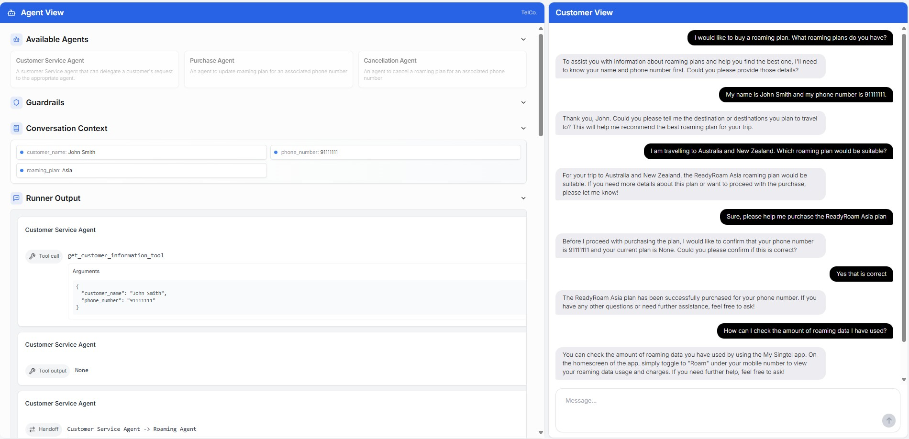

# Customer Service Agents Demo

[](LICENSE)


This repository contains a demo of a Customer Service Agent interface built on top of the [OpenAI Agents SDK](https://openai.github.io/openai-agents-python/).
It is composed of two parts:

1. A python backend that handles the agent orchestration logic, implementing the Agents SDK [customer service example](https://github.com/openai/openai-agents-python/tree/main/examples/customer_service)

2. A Next.js UI allowing the visualization of the agent orchestration process and providing a chat interface.



## How to use

### Setting your OpenAI API key

You must set your valid OpenAI API key in your environment variables by running the following command in your terminal:
```bash
export OPENAI_API_KEY=your_api_key
```

or if using powershell
```powershell
$env:OPENAI_API_KEY=your_api_key
```

Alternatively, you can modify the `compose.yaml` file and manually set the `OPENAI_API_KEY` environment variable. Take care not to expose your API key if so.

### Install dependencies

This demo requires Docker to be installed.

### Run the app
1. clone the repo to your own local directory. [Instructions here.](https://docs.github.com/en/repositories/creating-and-managing-repositories/cloning-a-repository)
2. in your local directory, run the docker compose file `docker compose up --build`
3. when app is ready, go to `http://localhost:3000` 

## Demo Flows

### Demo flow #1

1. **Start with a roaming plan purchase:**
   - User: "I would like to buy a roaming plan. What roaming plans do you have?"
   - The Customer Service (CS) Agent should recognize your intent and prompt you to provide your name & mobile number.

2. **After providing your information:**
   - User: "My name is MyName and my phone number is 12345678."
   - CS Agent will be update with your information, and hand you off to Roaming Agent.
   - Roaming Agent: "Thank you, MyName. To recommend the most suitable roaming plan for you, may I know which countries or destinations you are planning to travel to? This will help me suggest the best roaming plan options for your trip."

3. **Query travel destinations:**
   - User: "I am travelling to Australia and New Zealand. Which roaming plan would be suitable?"
   - Roaming agent will use a lookup tool to match the most appropriate roaming plan (Neighbours, Asia, Worldwide, or Others).
   - Roaming Agent: "For your trip to Australia and New Zealand, the ReadyRoam Asia plan would be suitable. If you would like, I can provide more details about this plan or help you with the purchase."

4. **Purchasing:**
   - User: "Sure, please help me purchase the ReadyRoam Asia plan"
   - Will be handed off to Purchase Agent, which requires additional confirmation.
   - Purchase Agent: "Just to confirm, your phone number is 12345678 and you want to purchase the "Asia" roaming plan, correct?"
     
5. **Approval**
   - User: "Yes that is correct"
   - Purchase Agent will purchase the plan (using tool) and hand off to CS agent
   - CS Agent: "The ReadyRoam Asia roaming plan has been successfully purchased for your phone number 12345678. If you have any other questions or need further assistance, feel free to ask!"

6. **Curiosity/FAQ:**
   - User: "How can I check the amount of roaming data I have used?" [(see FAQ "How can I check my data usage consumption?")](https://www.singtel.com/personal/products-services/mobile/roaming/faqs#9)
   - CS Agent will handoff to Roaming Agent, to use a RAG tool to answer FAQs.
   - Roaming Agent: "You can check the amount of roaming data you have used by using the My Singtel app. On the home screen, simply toggle to ‘Roam’ under your mobile number to view your roaming data usage and charges. If you need help with anything else, just let me know!"

This flow demonstrates how the system intelligently routes your requests to the right specialist agent, demonstrating tool usage & RAG, while managing the context to account for changes in state (e.g. roaming plan purchase).

### Demo flow #2
TBD

## known issues:
1. Node.js may run into installation & runtime issues. Easiest  

## License

This project is licensed under the MIT License. See the [LICENSE](LICENSE) file for details.
